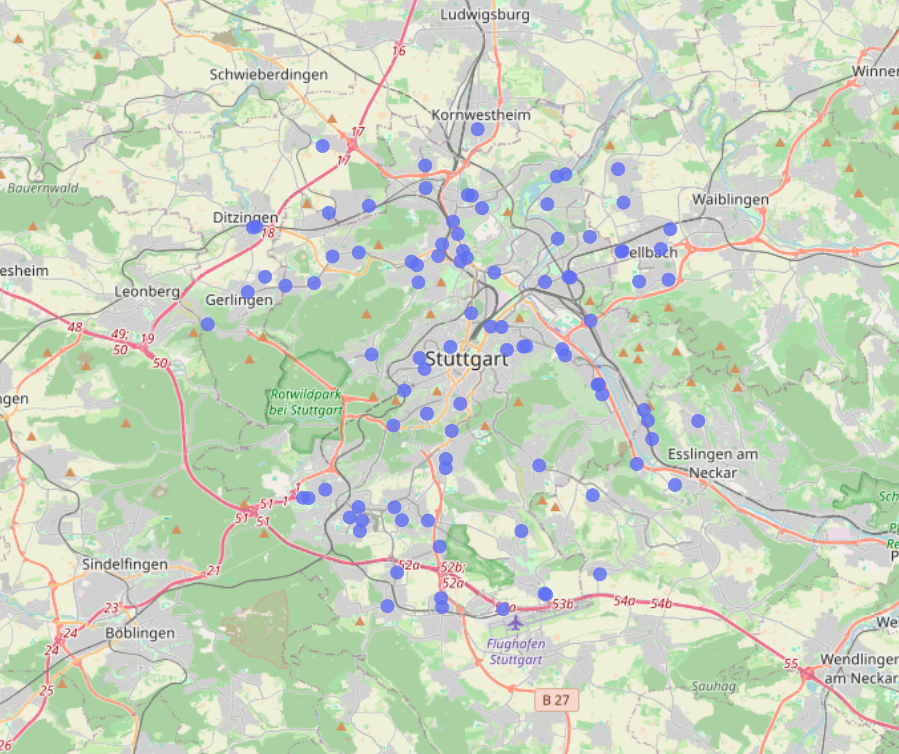
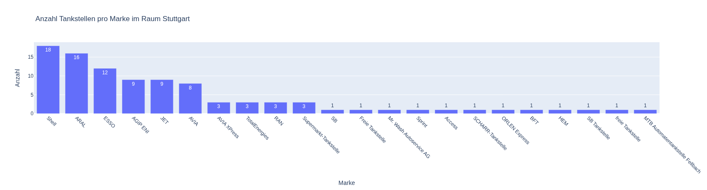
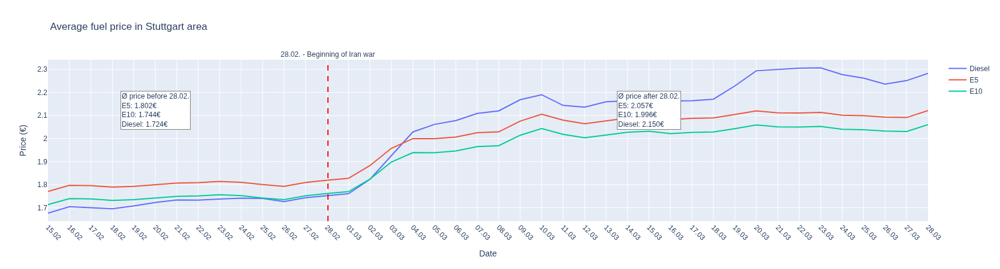
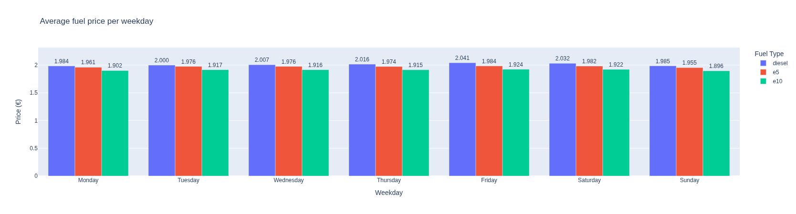
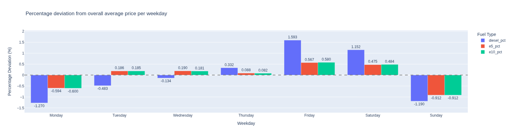
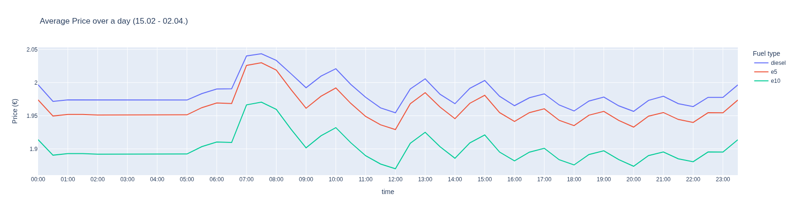
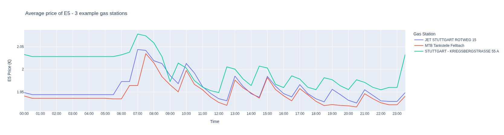
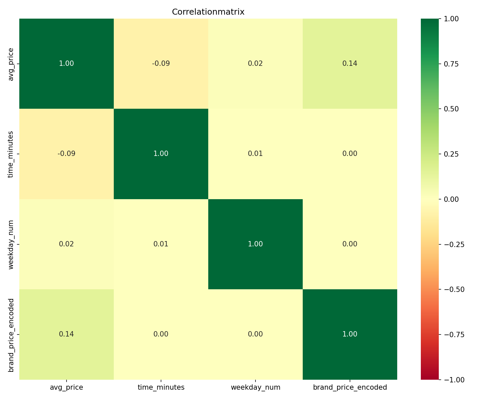
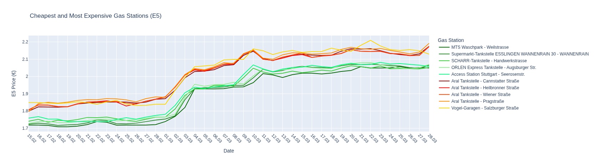

# gasstation-price-analysis


The data was collected using a separate ETL pipeline repository and stored in a 
PostgreSQL database. The analysis covers fuel prices (Diesel, E5, E10) from 96 
gas stations in the Stuttgart area between February and March 2026.

The goal of this analysis is to find out, how the avg. fuel price changes over time and when it is the best time to fuel up your car. 
How does the weekday, time of the day and the choice of gas station impact the price you pay for gas?

> The analysis is still in progress – more insights coming soon.


## Data exploration

To gain a deeper understanding of the collected data, we performed an initial exploration. This helps us identify patterns, validate data quality, and ensure the dataset is ready for further analysis.


### Data Overview
We queried the database for all records and analyzed the following key metrics:

- **Total datasets:** 188,640
- **Time period:** February 15, 2026, to March 28, 2026 (42 days)
- **Unique gas stations:** 96
- **Unique days with data:** 42

Data Collection Frequency
The data was collected at a high frequency to capture real-time fluctuations in fuel prices. Each day, we gathered:

- **Full days with complete data:** 42 days
- **Data points per full day:** 4,608
- **Data points per 30-minute interval:** 96 gas stations × 1 data point per station per 30 minutes

### Date Error

When exploring my data, I noticed something strange. I started my dag runs on 15.02. at 11:47. However I had data from that day at 00:00 and 00:30. 
I checked my dag file and noticed I only used Europe/Berlin Timezone for setting the time but not for the date. The retrieval date is then beeing set, using UTC, which is 1 hour behind, resulting in the wrong date beeing set at retrieval time of 00:00, and 00:30. 

To fix this, I changed the date beeing set at these times to +1 day. 


### Missing values

Checking for missing values:

```
Missing values:
id                  0
tankstellen_id      0
diesel             62
e5                302
e10                22
isopen              0
retrieval_time      0
retrieval_date      0
dtype: int64
```

Checking which gas stations were affected and when these gaps occurred.


|Missing E5-values per gas station       |     |
|:---------------------------------------|----:|
| ('Access Station Stuttgart', 'Access') | 281 |
| ('MTS Waschpark', 'SB Tankstelle')     |  21 |

|Missing E10-values per gas station  |     |
|:-----------------------------------|----:|
| ('MTS Waschpark', 'SB Tankstelle') |  22 |

Missing Diesel-values per gas station:
|Missing Diesel-values per gas station |   0 |
|:-------------------------------------|----:|
| ('MTS Waschpark', 'SB Tankstelle')   |  62 |


| retrieval_date   |   E5 |   E10 |   Diesel |
|:-----------------|-----:|------:|---------:|
| 2026-02-18       |   20 |     0 |        0 |
| 2026-02-19       |   48 |     0 |        0 |
| 2026-02-20       |   48 |     0 |        0 |
| 2026-02-21       |   48 |     0 |        0 |
| 2026-02-22       |   48 |     0 |        0 |
| 2026-02-23       |   48 |     0 |        0 |
| 2026-02-24       |   21 |     0 |        0 |
| 2026-03-01       |   11 |    12 |       15 |
| 2026-03-02       |   10 |    10 |       10 |
| 2026-03-20       |    0 |     0 |        6 |
| 2026-03-21       |    0 |     0 |       12 |
| 2026-03-22       |    0 |     0 |        9 |
| 2026-03-23       |    0 |     0 |       10 |


The missing values are not random but concentrated on just two stations.
The gaps were not continuous, but appeared in short, isolated time windows across a few days.

Given that this was time-series data, I decided to use a Forward Fill method to fill these values, since fuel prices typically change gradually, making it reasonable to assume that the last observed price is the most accurate estimate for the missing values. This approach preserves the temporal structure of the data while minimizing the impact on the overall trend and averages.


Minimal Impact: I compared the average fuel prices with and without Forward Fill. The deviations were small but negligible when looking at all gas stations. If these gas stations will be in the top cheapest/most expensive gas stations, we will have to take a closer look.

Comparison of avg. prices MTS Waschpark:
|        |   With NaN (ignored) |   With Forward Fill |   Deviation (%) |
|:-------|---------------------:|--------------------:|----------------:|
| e5     |               1.8951 |              1.8937 |           -0.07 |
| e10    |               1.8353 |              1.8337 |           -0.09 |
| diesel |               1.9037 |              1.9067 |            0.16 |

Comparison of avg. prices Access Station Stuttgart:
|        |   With NaN (ignored) |   With Forward Fill |   Deviation (%) |
|:-------|---------------------:|--------------------:|----------------:|
| e5     |               1.9585 |              1.9271 |            -1.6 |
| e10    |               1.8704 |              1.8704 |             0   |
| diesel |               1.9983 |              1.9983 |             0   |


Geographical Data

Also I want to check the geographical data and the different gas station brands



Checking for different brands we see that there are are several big brands with a high number of gasstations in Suttgart, like Shell and Aral.

However there also small and unknown brands with just one gasstation. We will check later how prices differ from the big brands to small ones.

|    | brand                            |   anzahl |
|---:|:---------------------------------|---------:|
|  0 | Shell                            |       18 |
|  1 | ARAL                             |       16 |
|  2 | ESSO                             |       12 |
|  3 | AGIP ENI                         |        9 |
|  4 | JET                              |        9 |
|  5 | AVIA                             |        8 |
|  6 | AVIA XPress                      |        3 |
|  7 | TotalEnergies                    |        3 |
|  8 | RAN                              |        3 |
|  9 | Supermarkt-Tankstelle            |        3 |
| 10 | SB                               |        1 |
| 11 | Freie Tankstelle                 |        1 |
| 12 | Mr. Wash Autoservice AG          |        1 |
| 13 | Sprint                           |        1 |
| 14 | Access                           |        1 |
| 15 | SCHARR-Tankstelle                |        1 |
| 16 | ORLEN Express                    |        1 |
| 17 | BFT                              |        1 |
| 18 | HEM                              |        1 |
| 19 | SB Tankstelle                    |        1 |
| 20 | freie Tankstelle                 |        1 |
| 21 | MTB Automatentankstelle Fellbach |        1 |



## Analysis

When first looking at the average price of fuel over the entire time I collected data, the price jump of fuel is obvious after the start of the war in Iran. 

On 28.02. the US and Isreal attacked Iran, which led to a massiv jump in fuel prices. 




If we compare the timeframe before the 28.02. with the one after the 28.02. we see that the prices of fuel have gone up atleast 14%. The prices of diesel grew the most, from 1.72€ to 2.15€, which is a raise of 24.68%. This is mostly because diesel is more crisis-prone, plays a larger role in industry, is often used as a substitute for gas, and Germany relies more on diesel imports, whereas domestic refineries can cover much of the gasoline demand.

| Time period     |   Ø Diesel (€) |   Ø E5 (€) |   Ø E10 (€) |
|:----------------|---------------:|-----------:|------------:|
| 15.02. - 28.02. |          1.724 |      1.802 |       1.744 |
| 28.02. - 02.04. |          2.15  |      2.057 |       1.996 |
| Deviation (%)   |         24.683 |     14.167 |      14.469 |

However, because this is something that we do not have any control over, we will analyse the enitre timeframe as it is, to find out what other factor effect the gas prices.


### Weekday

If we look at the average price of fuel per weekday we will get a diagramm that is looking relatively even.



If we look at the relative change compared to the average price, we see that the price of fuel is the cheapest on Sunday and Monday and the msot expensive on Thursday. 

However we should look at this later on in more detail as to find out whether just the average price is the lowest/highest on those days or they really have the cheapest or most expensive prices per week.



| Weekday     |   Ø Diesel (€) |   Ø E5 (€) |   Ø E10 (€) |   Diesel      (%) |   E5      (%) |   E10      (%) |
|:------------|---------------:|-----------:|------------:|------------------:|--------------:|---------------:|
| Monday      |          1.984 |      1.961 |       1.902 |            -1.27  |        -0.594 |         -0.6   |
| Tuesday     |          2     |      1.976 |       1.917 |            -0.483 |         0.186 |          0.185 |
| Wednesday   |          2.007 |      1.976 |       1.916 |            -0.134 |         0.19  |          0.181 |
| Thursday    |          2.016 |      1.974 |       1.915 |             0.332 |         0.088 |          0.082 |
| Friday      |          2.041 |      1.984 |       1.924 |             1.593 |         0.567 |          0.58  |
| Saturday    |          2.032 |      1.982 |       1.922 |             1.152 |         0.475 |          0.484 |
| Sunday      |          1.985 |      1.955 |       1.896 |            -1.19  |        -0.912 |         -0.912 |
| Gesamt      |          2.009 |      1.973 |       1.913 |             0     |         0     |          0     |

### Time of the day

Next I look at the average price of fuel over the time of the day. It is clear that you should avoid the early mornings, around 7:00 - 8:00 o'clock as the prices reach their maximum values here. 

It will be the cheapest at around 12:00 and in the evening at around 20:00.



It is noticeable that the price is constanly going up and down, creating a local minimum and maximum every full hour. To make sure this is nto a error in the data or API call, I looked at 3 different gas stations and their average price of E5 over the course of a day. 




When comparing the average prices throughout all gasstations on 7:30 and 12:00 o'clock we see that the average price difference on any given day is about 5%.

| retrieval_date   |   diesel_pct |   e5_pct |   e10_pct |
|:-----------------|-------------:|---------:|----------:|
| 2026-02-16       |       -8.367 |   -6.904 |    -7.029 |
| 2026-02-17       |       -8.126 |   -6.93  |    -7.098 |
| 2026-02-18       |       -8.842 |   -7.642 |    -7.785 |
| 2026-02-19       |       -7.929 |   -7.296 |    -7.523 |
| 2026-02-20       |       -7.868 |   -7.028 |    -7.121 |
| 2026-02-21       |       -7.994 |   -7.12  |    -7.284 |
| 2026-02-22       |       -7.636 |   -6.653 |    -6.751 |
| 2026-02-23       |       -7.795 |   -6.559 |    -6.784 |
| 2026-02-24       |       -7.507 |   -6.439 |    -6.666 |
| 2026-02-25       |       -7.678 |   -6.656 |    -6.785 |
| 2026-02-26       |       -7.025 |   -6.558 |    -6.662 |
| 2026-02-27       |       -7.451 |   -6.457 |    -6.589 |
| 2026-02-28       |       -7.382 |   -6.301 |    -6.581 |
| 2026-03-01       |       -6.465 |   -5.962 |    -6.066 |

...


| Type of gas | Average Deviation 07:30 → 12:00:|
|:------------|--------------------------------:|
|Diesel:      | -4.89%                          |
|E5:          | -5.48%                          |
|E10:         | -5.62%                          |

## Correlation

We can check correlation in our data. For this I calculated the avg. price of fuel for each datapoint, resulting in an avg. price for each timestamp and gasstation. We see that the weekday almost has no influence on the price and the time of the day just a tiny bit with -0.09. Of course there is no linear correlation, like we saw above, when checking the avg. price over a whole day.

However we see that that we have a correlation between the average price and a specific gas station name.




### Gasstation

We already analysed the difference in gas prices on different weekdays and different times of the day. However, different gas stations have different prices.




| Category     | Gas station                                                |   Ø E5 07:30 |   Ø E5 12:00 |   Ø E5 20:00 |   Differenz (%) 12:00 |   Differenz (%) 20:00 |
|:-------------|:-----------------------------------------------------------|-------------:|-------------:|-------------:|----------------------:|----------------------:|
|              | MTS Waschpark - Weilstrasse                                |        1.897 |        1.894 |        1.889 |                -0.158 |                -0.422 |
|              | Access Station Stuttgart - Seerosenstr.                    |        2     |        1.907 |        1.917 |                -4.65  |                -4.15  |
| Cheapest 5   | ORLEN Express Tankstelle - Augsburger Str.                 |        2     |        1.896 |        1.897 |                -5.2   |                -5.15  |
|              | SCHARR-Tankstelle - Handwerkstrasse                        |        2.007 |        1.9   |        1.899 |                -5.331 |                -5.381 |
|              | Supermarkt-Tankstelle ESSLINGEN WANNENRAIN 30 - WANNENRAIN |        2.01  |        1.902 |        1.901 |                -5.373 |                -5.423 |
|--------------|------------------------------------------------------------|--------------|--------------|--------------|-----------------------|-----------------------|
|              | Vogel-Garagen - Salzburger Straße                          |        2.045 |        2.031 |        2.019 |                -0.685 |                -1.271 |
|              | Aral Tankstelle - Cannstatter Straße                       |        2.064 |        1.952 |        1.953 |                -5.426 |                -5.378 |
| Most         | Aral Tankstelle - Heilbronner Straße                       |        2.069 |        1.954 |        1.952 |                -5.558 |                -5.655 |
| Expensive 5  | Aral Tankstelle - Pragstraße                               |        2.072 |        1.975 |        1.954 |                -4.681 |                -5.695 |
|              | Aral Tankstelle - Wiener Straße                            |        2.072 |        1.954 |        1.952 |                -5.695 |                -5.792 |

Average per category
| Category     |   Ø E5 07:30 |   Ø E5 12:00 |   Ø E5 20:00 |  Difference (%) 12:00 |  Difference (%) 20:00 |
|:-------------|-------------:|-------------:|-------------:|----------------------:|----------------------:|
| expensive 5  |        1.983 |        1.9   |        1.901 |                -4.142 |                -4.105 |
| cheapest 5   |        2.064 |        1.973 |        1.966 |                -4.409 |                -4.758 |


If wee look at the average fuel price for each gasstation we can compare gasstations with the lowest average price to gassstations with the highest average price.


# Calculation

The average german drives 

The average car consumes x diesel and x in euro. 
https://www.destatis.de/DE/Themen/Gesellschaft-Umwelt/Umwelt/UGR/verkehr-tourismus/Tabellen/fahrleistungen-kraftstoffverbrauch.html


https://www.destatis.de/DE/Themen/Arbeit/Arbeitsmarkt/Erwerbstaetigkeit/Tabellen/pendler1.html

